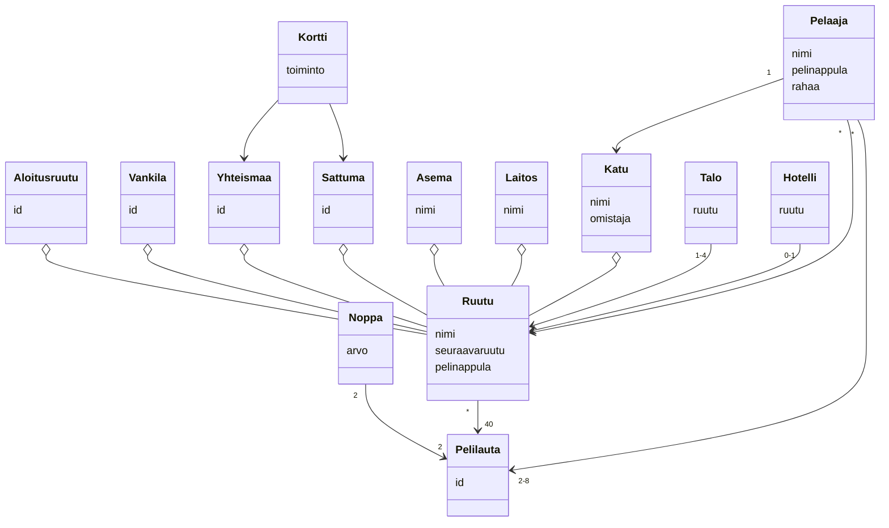

```mermaid 
classDiagram
    Pelaaja "*" --> "2-8" Pelilauta
    Noppa "2" --> "2" Pelilauta
    Ruutu "*" --> "40" Pelilauta
    Pelaaja "*" --> Ruutu
    Aloitusruutu o-- Ruutu
    Vankila o-- Ruutu
    Sattuma o-- Ruutu
    Yhteismaa o-- Ruutu
    Asema o-- Ruutu
    Laitos o-- Ruutu
    Katu o-- Ruutu
    Kortti --> Sattuma
    Kortti --> Yhteismaa
    Talo "1-4" --> Ruutu
    Hotelli "0-1" --> Ruutu
    Pelaaja "1" --> Katu
    class Pelaaja{
        nimi
        pelinappula
        rahaa
    }
    class Noppa{
        arvo
    }
    class Ruutu{
        nimi
        seuraavaruutu
        pelinappula
    }
    class Pelilauta{
        id
    }
    class Aloitusruutu{
        id
    }
    class Vankila{
        id
    }
    class Sattuma{
        id
    }
    class Yhteismaa{
        id
    }
    class Asema{
        nimi
    }
    class Laitos{
        nimi
    }
    class Katu{
        nimi
        omistaja
    }
    class Kortti{
        toiminto
    }
    class Talo{
        ruutu
    }
    class Hotelli{
        ruutu
    }
```

