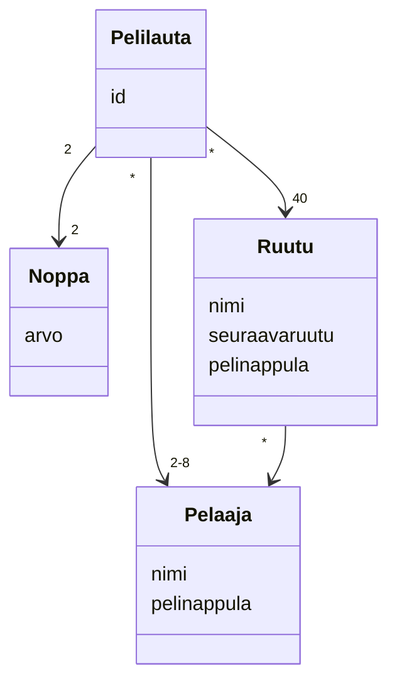

```mermaid 
classDiagram
    Pelilauta "*" --> "2-8" Pelaaja
    Pelilauta "2" --> "2" Noppa
    Pelilauta "*" --> "40" Ruutu
    Ruutu "*" --> Pelaaja
    class Pelaaja{
        nimi
        pelinappula
    }
    class Noppa{
        arvo
    }
    class Ruutu{
        nimi
        seuraavaruutu
        pelinappula
    }
    class Pelilauta{
        id
    }
```
