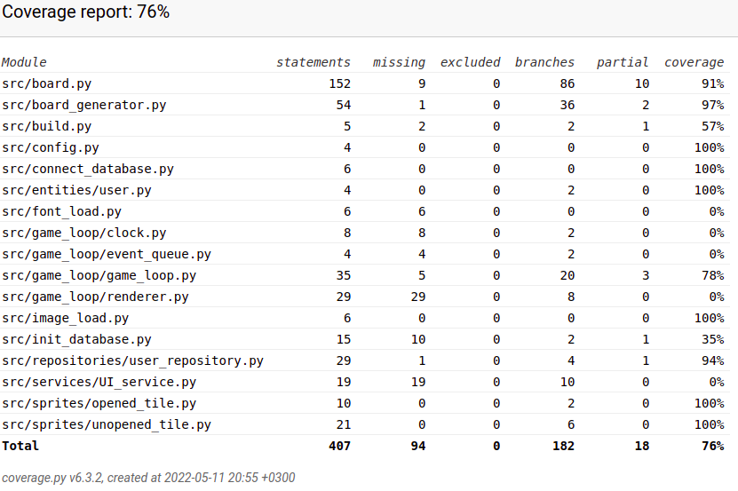

# Testausdokumentti
Ohjelmaa on testattu unittestilla sekä stubEventeillä.
## Yksikkö- ja integraatiotestaus
### Sovelluslogiikka
Sovelluslogiikkaa testataan Board-luokkaa testaamalla [TestBoard](https://github.com/justusmarttila/ot-harjoitustyo/blob/master/minesweeper-game/src/tests/board_test.py)
### Pelisilmukka
Pelisilmukkaa testaan TestGameLoop-luokassa StubEventeillä [TestGameLoop](https://github.com/justusmarttila/ot-harjoitustyo/blob/master/minesweeper-game/src/tests/game_loop_test.py)
### Repositorio-luokka
User repositorya testataan TestUserRepository-luokassa [TestUserRepository](https://github.com/justusmarttila/ot-harjoitustyo/blob/master/minesweeper-game/src/tests/user_repository_test.py)
### Testikattavuus
Testikattavuuden ulkopuolelle on jätetty ui-tiedoston sisältö ja ilman sitä kattavuus on

